# Whitepaper: The Case for Prompt-Driven Development

# **Introduction: Addressing the Maintenance Burden**

Traditional software development faces a significant challenge: the overwhelming cost of maintenance. Research estimates suggest that 80-90% of development costs are incurred *after* the initial code is written, primarily in modifications and updates over the system's lifetime.¹ 

Modifying existing code—often patched and complex—is akin to renovating an old house: frequently more expensive and complex per unit than building new. This "legacy code" problem often makes starting from scratch seem easier than adapting what exists. Interactive AI coding tools excel at making *local* patches, but this approach often exacerbates the long-term maintenance burden by creating complex, interwoven code structures.

**Prompt-Driven Development (PDD) proposes a paradigm shift to tackle this core issue.** Instead of treating source code as the primary artifact of a software system, PDD elevates the **prompt** to this central role. The core idea is to maintain and evolve the prompt, **regenerating** the code as needed, rather than continuously **patching** the code itself.

¹ *While specific percentages vary across studies, the maintenance burden consistently represents the majority of software lifecycle costs across industry research and practitioner reports.*

## **Comparing Maintenance Models: PDD vs Traditional Approaches**

```mermaid

flowchart LR
    subgraph Trad["Traditional/Patching Approach"]
        direction TB
        TF["Documentation/\nSpecs"] -->|Initially Aligned| TA["Initial Code"]
        TF -. Gradually Drifts .-> TG["Stale\n(out of sync)"]
        
        TA --> TB["Patch 1"]
        TB --> TC["Patch 2"]
        TC --> TD["Patch 3"]
        TD --> TE["Complex, Tangled\nCodebase"]
        
        style TE fill:#ffcccc,stroke:#cc0000
        style TG fill:#ffcccc,stroke:#cc0000
    end
    
    subgraph PDD["Prompt-Driven Development"]
        direction TB
        PA["Initial Prompt"] --> PB["Updated Prompt"]
        PB --> PC["Final Prompt"]
        
        PC -->|Regenerate| PD["Clean, Fresh\nCodebase"]
        PC -->|Generate| PE["Example/Interface"]
        PC -->|Generate| PF["Unit Tests"]
        
        PD -->|"Feed back\nInsights"| PG["Implementation\nLearnings"]
        PE -->|"Feed back\nInsights"| PG
        PF -->|"Feed back\nInsights"| PG
        PG -->|Back-propagate| PC
        
        style PC fill:#ccffcc,stroke:#00cc00
        style PD fill:#ccffcc,stroke:#00cc00
    end
    
    Trad --- PDD
    
    classDef default fill:#f9f9f9,stroke:#333,stroke-width:1px
```

## **The Paradigm Shift: Prompts as the New Source Code**

This shift mirrors historical transitions in other engineering fields. In chip design, the primary artifact evolved from low-level netlists (schematics) to High-Level Description Languages (HDLs) like Verilog and VHDL. Initially, the synthesized netlist was still considered primary, but today, the HDL code is universally recognized as the source of truth. PDD envisions a similar evolution for software, where prompts become the high-level, authoritative description from which code is derived.

This transition elevates the developer's role, moving them to a higher level of abstraction, akin to the evolution from assembly language to C to Python, and now to prompts. Developers focus more on intent, logic, and system design, gaining leverage and accelerating development.

## **Core Principles of Prompt-Driven Development**

PDD is built on several fundamental concepts, detailed in the PDD methodology:

1. **Prompts as the Source of Truth**: The prompts, written primarily in natural language, authoritatively define the system's intended behavior. Code becomes a generated artifact derived from these prompts.
2. **Regenerative Development**: Changes are implemented by modifying the relevant prompt(s) and regenerating the affected code. This avoids the accumulation of patches and maintains conceptual integrity.
3. **Intent Preservation**: Prompts capture the "why" behind the code, preserving design rationale more effectively than code comments alone.
4. **Modularity**: Similar to code, prompts are designed as modular units, often linked via minimal "example" files that act as interfaces, promoting reusability and token efficiency.
5. **Synchronization**: A core tenet is maintaining synchronization between the prompt, the generated code, usage examples, and tests. Learning gained during implementation is fed back into the prompts, ensuring they remain accurate and up-to-date. This contrasts with patching approaches, where documentation and original specifications often become stale.
6. **Batch-Oriented Workflow**: PDD is fundamentally designed as a batch process, allowing for scripted, reproducible generation, contrasting with the inherently interactive nature of many code-patching AI tools.

## **Key Benefits of PDD**

Adopting a PDD approach offers numerous advantages, particularly when contrasted with direct code patching using interactive AI assistants:

- **Reduced Maintenance Cost & Effort**: By regenerating code from updated prompts, PDD avoids the "rat's nest" complexity that arises from repeated patching. Refactoring and implementing significant changes become significantly easier and cleaner.
- **Increased Efficiency & Speed (Developer Focus & Throughput)**: Developers operate at a higher abstraction level. While a single patch might seem faster interactively, PDD's batch nature frees up developer time by eliminating the need to constantly "babysit" the AI, leading to greater overall throughput, especially on larger tasks.
- **Cost Savings (LLM Usage)**:
    - **Token Efficiency**: PDD workflows, being more structured and modular (using examples as interfaces), can be more deterministic and token-efficient compared to the potentially verbose interactions of purely agentic/chat-based coding assistants.
    - **Batch Processing API Discounts**: PDD is inherently suited to batch-mode generation. Developers can define prompts, launch the generation process, and return later. Large Language Model (LLM) providers often offer significant discounts (e.g., 50% off) for batch processing APIs compared to the more expensive interactive APIs required by constantly supervised tools.

### **Batch vs. Interactive Workflow Timelines**

```mermaid
gantt
    title Developer Time Utilization: Interactive vs. Batch Approaches
    dateFormat  HH:mm
    axisFormat %H:%M
    section Interactive/Patching
    Define initial prompt      :a1, 00:00, 5m
    Review & direct AI         :a2, after a1, 5m
    Review & redirect AI       :a3, after a2, 5m
    Review & fix output        :a4, after a3, 5m
    Review & redirect AI       :a5, after a4, 5m
    Review & fix output        :a6, after a5, 5m
    Review & redirect AI       :a7, after a6, 5m
    Final review & integration :a8, after a7, 10m
    section PDD (Batch)
    Define/refine prompt       :b1, 00:00, 15m
    Launch generation          :milestone, after b1, 0m
    AI batch processing        :b2, after b1, 30m
    Developer works on other tasks :b3, after b1, 30m
    Review results & integrate :b4, after b2, 10m

```

*Figure 1: Comparison of developer time utilization in interactive vs. batch (PDD) workflows. While both approaches might use similar total LLM processing time, the PDD approach frees the developer from constant supervision, allowing them to work on other tasks while batch processing occurs.*

- **Enhanced Control & Consistency**: PDD provides more direct control over the generation process. Prompts are attached to specific code modules, making the generation highly directed and reproducible, unlike less predictable, "universal chatbot" style interactions.
- **Improved Collaboration & Accessibility**: Prompts, being in natural language, serve as a common language accessible to both technical and non-technical stakeholders. Unlike code-centric patching workflows, this facilitates business logic validation and keeps everyone aligned.
- **Easier Onboarding**: New team members can understand the system's purpose and structure by reading the prompts, which are typically much shorter and more precise than the complete codebase resulting from numerous patches.
- **Better Scalability & Complexity Management**: For large, complex systems, PDD's directed, modular approach with regeneration offers more control and manageability than repeatedly patching a large, monolithic codebase via interactive chat.
- **Enhanced Code Quality (via Explicit Context)**: PDD emphasizes systematically finding and providing relevant context (like few-shot examples, potentially sourced from a shared cloud) to the LLM during generation. Well-chosen context can allow even less powerful models to outperform stronger models that lack context, leading to higher-quality, more accurate code generation compared to zero-shot or implicit context approaches.
- **Adaptability**: PDD excels in scenarios requiring frequent changes or evolution. Modifying high-level prompts is often simpler and safer than performing deep surgery on patched code.
- **Systematic Prompt Management**: PDD treats generation prompts as critical, version-controlled artifacts, unlike interactive approaches where valuable generation logic may be lost in chat history.
- **Integration**: PDD tools are designed to be complementary to existing development environments (like VS Code) and agentic tools (like Cursor or Cloud Code), often integrating via protocols like Model Context Protocol (MCP). They can be used *together*.

## **PDD in Context: Comparison with Other Approaches**

To fully appreciate PDD, it's helpful to contrast it with other common software development methodologies and tools:

- **PDD vs. Traditional Manual Coding:** Traditional coding offers maximum direct control but is often slower, especially for complex tasks, and struggles with the maintenance burden described earlier. PDD accelerates development by leveraging LLMs and raises the abstraction level from syntax details to defining intent via prompts. It directly tackles long-term maintenance by making regeneration from prompts the primary update mechanism.
- **PDD vs. Interactive AI-Assisted Patching (e.g., Cursor, Aider):** While both use Large Language Models (LLMs), their core philosophies differ significantly.
    - *Primary Artifact:* PDD elevates the **Prompt** to the source of truth. Interactive tools typically treat the **Code** as primary, using ephemeral chat instructions for direct patching.
    - *Workflow:* PDD is primarily **batch-oriented** and **regenerative**, freeing developer time. Interactive tools are inherently **interactive**, requiring constant supervision for patching.
    - *Maintenance:* PDD favors **regeneration** to avoid complexity creep. Interactive patching risks accumulating technical debt if not managed carefully.
    - *Synchronization:* PDD includes mechanisms (`pdd update`, back-propagation) to keep prompts aligned with implementation. Interactive tools lack this systematic prompt-synchronization loop.
    - *Leveraging LLM Improvements:* As LLMs grow more powerful and reliable in generating longer, more complex code blocks, PDD's regenerative model is better positioned to leverage these advancements for substantial generation tasks. Interactive patching, focused on incremental changes, was arguably more necessary when LLMs were limited but may underutilize the capabilities of modern models for larger-scale regeneration.
- **PDD vs. Test-Driven Development (TDD):** PDD shares Test-Driven Development's (TDD) emphasis on the importance of testing. However, TDD typically involves writing tests *before* manually writing minimal code to pass them. PDD uses prompts to generate the code, examples, *and* initial tests (`pdd generate`, `pdd example`, `pdd test`). While tests guide refinement in PDD (via `pdd fix`), the prompt remains the ultimate source of functional intent, and the initial code generation is LLM-driven, not manual.

In essence, PDD offers a unique blend: the speed and automation potential of LLMs, combined with a structured, prompt-centric methodology focused on long-term maintainability, synchronization, and leveraging batch processing efficiencies, setting it apart from both purely manual methods and purely interactive AI patching tools.

## **Visual: Collaboration Model Comparison**

The following diagram illustrates how PDD transforms collaboration between different stakeholders by making prompts (rather than code) the central shared artifact:

```mermaid

flowchart LR
    subgraph Traditional ["Interactive AI-Assisted Development"]
        direction TB
        TS[Specifications/PRDs] --> TD[Developers]
        TD --> TI[Interactive Chat/\nSingle-use Prompts]
        TI --> TD
        TI --> TC[Generated Code]
        TC --> TI
        TPM[Product Managers] --> TS
        
        classDef artifact fill:#f9f,stroke:#333,stroke-width:2px
        classDef stakeholder fill:#bbf,stroke:#333,stroke-width:2px
        class TC,TS,TI artifact
        class TD,TPM stakeholder
    end
    
    subgraph PDD ["Prompt-Driven Development"]
        direction TB
        PP[Versioned Prompts] <--> PD[Developers]
        PP <--> PPM[Product Managers]
        PP --> PC[Generated Code]
        PC -- "Technical Learnings" --> PP
        
        class PP,PC artifact
        class PD,PPM stakeholder
    end
    
    Traditional ~~~ PDD
```

In traditional interactive AI-assisted development, developers create ephemeral prompts in chat interfaces to generate code, but these prompts are typically lost and not systematically preserved. PDD transforms this by making versioned prompts the central, persisted artifact that both developers and product managers actively contribute to and maintain. Crucially, technical learnings gained during implementation are back-propagated to keep prompts updated, ensuring continuous synchronization with the generated code.

## **Addressing Potential Concerns**

While PDD offers significant advantages, potential challenges exist:

- **Learning Curve**: Developers need to shift their mindset and develop skills in writing effective, concise prompts that specify *what* is needed, not necessarily *how* to implement it. Using agentic tools to help draft and refine prompts can ease this transition.
- **Prompt Quality & Consistency**: Poorly written or non-standardized prompts could lead to inconsistent results. Emphasizing clarity, conciseness, and potentially team standards or preambles (similar to style guides) helps mitigate this.
- **Synchronization Overhead**: While keeping diverse artifacts synchronized traditionally required immense, often impractical, manual discipline, **LLMs fundamentally change this calculus.** PDD leverages LLM capabilities for automation (e.g., using `pdd update` potentially orchestrated via Makefiles) to handle the crucial back-propagation of changes (from code/tests back to prompts/specs). This transforms constant synchronization from an impractical ideal into a core, achievable workflow component.
    - **Depth of Customization**: Concerns may arise that prompts can't capture every nuance required. PDD addresses this by allowing for detailed prompts when necessary and focusing on specifying the desired outcome clearly. The `test` and `fix` cycles further ensure requirements are met. For very small, localized fixes, direct patching might *feel* faster in the moment, but PDD prioritizes long-term maintainability by keeping the prompt as the source of truth. A balanced approach, perhaps using tests to guide prompt fixes even for small bugs, is often optimal.
- **Dependency Management**: Changes in one prompt/module could affect others. This is managed through modular design, clear interfaces (examples), and comprehensive testing to catch integration issues early. PDD's structure helps manage this more systematically than ad-hoc patching.

**When PDD May Not Be Optimal**: While PDD demonstrates broad applicability, certain scenarios may favor alternative approaches. Very small, one-off scripts or quick experimental prototypes might benefit from direct interactive coding. Additionally, projects with extremely tight deadlines where any upfront investment in prompt structuring feels prohibitive might initially seem better suited to immediate patching approaches—though this often proves costlier in the long term as complexity grows.

## **The PDD Workflow: A Synchronized Cycle**

```mermaid
flowchart TD
    subgraph Initialization
        A[Requirements/PRD] -->|Break down| B[Define Prompt]
        B -->|Find Context| C["auto-deps\n(Relevant Examples)"]
    end
    
    subgraph Generation
        C --> D["generate\n(Create Code Module)"]
        B --> E["example\n(Create Usage Example)"]
        D -.->|Reference| E
    end
    
    subgraph Verification
        E --> F["fix\n(Resolve Crashes)"]
        F --> G["verify\n(Functional Correctness)"]
        G -->|Issues| F
    end
    
    subgraph Testing
        G -->|Passes| H["test\n(Generate Unit Tests)"]
        C -.->|Context| H
        D -.->|Reference| H
        H --> I["fix\n(Resolve Bugs)"]
        I -->|Bugs Remain| I
    end
    
    subgraph Synchronization
        I -->|Tests Pass| J["update\n(Sync Changes to Prompt)"]
        J -->|Back-propagate| K["Update Architecture/Specs"]
        K -.->|Future Changes| A
    end
    
    style A fill:#f9f,stroke:#333
    style B fill:#f96,stroke:#333
    style J fill:#bbf,stroke:#333
    style K fill:#bbf,stroke:#333

```

**Key Principle: Test Accumulation** A crucial aspect of this workflow is the longevity of tests. When prompts are updated and code is regenerated, existing unit tests should ideally be preserved and potentially augmented with new ones. The goal is not to discard old tests but to accumulate a growing suite that acts as a regression safety net, ensuring that previously working functionality remains correct even as the system evolves.

A typical PDD workflow involves a **batch-oriented, synchronized cycle**, contrasting with the constant supervision model of interactive patching:

1. **Define**: Start with a requirement (e.g., from a PRD) and break it down into a specific prompt for a code module. Use `auto-deps` to find and include necessary context.
2. **Generate**: Use `generate` to create the code module from the prompt.
3. **Example**: Use `example` to create a minimal usage example (the interface).
4. **Verify (Initial)**: Use `verify` or `crash` to ensure the example/code runs and aligns with the prompt's intent, fixing basic issues iteratively.
5. **Test**: Use `test` to generate unit tests for the code module.
6. **Fix**: Use `fix` along with the generated tests to identify and correct bugs in the generated code, iterating until tests pass.
7. **Update & Back-propagate**: Use `update` to synchronize any necessary changes made during fixing back to the prompt. Crucially, propagate these learnings back up the chain to architectural specs or parent prompts to ensure consistency across the system.

The fundamental unit is often considered the prompt and its generated code, example, and test file – all kept in sync. If a prompt is too complex to generate correctly in one shot (even with fixing), it should be split (`split`) into smaller, manageable units.

## **Benchmark Case Studies: PDD vs. Interactive AI Development**

This section presents real-world case studies evaluating Prompt-Driven Development (PDD) against interactive AI-assisted development approaches across different types of applications. The studies demonstrate PDD's versatility and effectiveness across various domains, from creative applications to complex developer tooling.

### **Case Study 1: HandPaint Interactive Drawing Application**

The first case study compares PDD with Vibecoding (a Claude 3.5 Sonnet-based interactive approach) for developing HandPaint, an interactive drawing application using computer vision for finger-based drawing and palm-based erasing.

#### **1.1 Executive Summary**

The HandPaint development comparison reveals significant advantages for PDD in developer time efficiency and cost-effectiveness:

Key findings include:
*   **Active User Time**: PDD required only 17 minutes of active user attention compared to Vibecoding's 38 minutes (55% reduction)
*   **Multitasking Capability**: PDD enabled 24 minutes of background processing where users could work on other tasks
*   **Cost Efficiency**: PDD averaged $0.19 per run across 8 runs ($1.52 total). Vibecoding's costs were not tracked due to the interactive nature of the tool making precise cost measurement challenging during real-time development sessions.
*   **Development Models**: Vibecoding used Claude 3.5 Sonnet (Anthropic's AI coding assistant); PDD used Gemini 2.5 Pro Preview
*   **Total Development Time**: Comparable overall (38 minutes vs 41 minutes), but PDD freed users from constant supervision

#### **1.2 Methodology and Results**

**Development Approach Comparison:**
- **Vibecoding**: Required continuous user attention for 38 minutes with 11 interactive prompts
- **PDD**: 41-minute total session with only 17 minutes of active user time, remainder automated

**Key Performance Metrics:**
- **User Attention Efficiency**: 55% reduction in active user time with PDD
- **Resource Utilization**: PDD's background processing model vs. Vibecoding's real-time interaction requirement
- **Cost per Development Cycle**: $0.19 (PDD) - Vibecoding costs not tracked due to measurement challenges in interactive sessions
- **Scalability**: PDD's batch approach allows multiple parallel developments

#### **1.3 Development Experience Analysis**

The HandPaint case study demonstrates PDD's advantage in **cognitive load management**. While both approaches achieved functional results, PDD's batch-oriented workflow allowed developers to:

1. **Front-load problem definition** into structured prompts
2. **Leverage background processing** for routine generation tasks  
3. **Focus mental energy** on high-level design decisions rather than turn-by-turn supervision
4. **Maintain productivity** on other tasks during automated processing phases

**Quality Assessment**: Both approaches produced functional applications, with PDD requiring basic prompt engineering knowledge while Vibecoding provided more polished defaults. However, PDD's cost-effectiveness and time efficiency made it the superior choice for resource-conscious development.

### **Case Study 2: PDD vs. Claude Code for Edit File Tool Development**

The second case study presents a comprehensive evaluation of PDD against Claude Code (Anthropic's CLI tool) for developing a complex Edit File Tool that leverages Claude's `text_editor_20250124` model. This study analyzes performance across development cost, time, success rates, and runtime efficiency.

#### **2.1 Executive Summary**

The case study reveals significant performance differences between PDD and Claude Code in developing the Edit File Tool. PDD demonstrated superior success rates and API cost efficiency, while also completing the creation task in a single, albeit longer, session. Claude Code, while having a slightly lower total creation cost in aggregate over multiple attempts, exhibited a much lower success rate in benchmarked tasks and incurred higher API costs per successful operation.

Key findings include:
*   **Overall Success Rate**: PDD achieved a 100.00% success rate in benchmarked tasks, whereas Claude Code's success rate was 46.67%.
*   **Execution Performance (Runtime)**: PDD's average execution time per task was 37.3605 seconds, compared to 50.7765 seconds for Claude Code.
*   **API Cost Efficiency (Runtime)**: PDD's average API cost per task was $0.0789, significantly lower than Claude Code's $0.3617.
*   **Creation Cost and Effort**: PDD's single creation process cost $29.92 and took 7h 5m 56.1s. Claude Code's 5 attempts totaled $28.53 in cost and 6h 18m 55.4s in wall duration.
*   **Primary Cause of Claude Code's failures**: Claude Code's tool's primary failure mode exceeded the maximum edit iterations, suggesting it struggled to converge on a correct solution. This unreliability undermines its practical use.

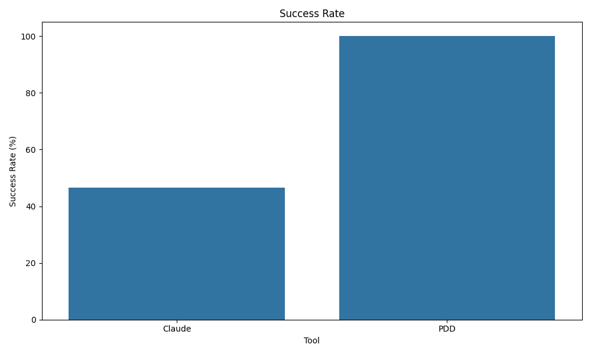
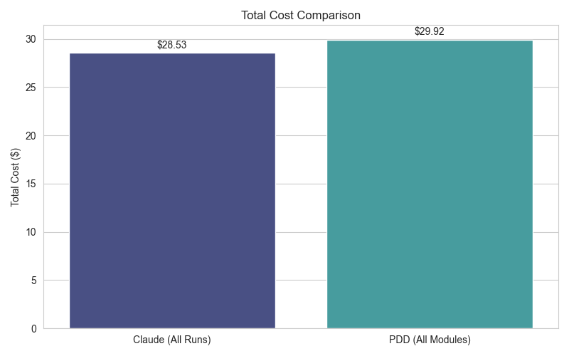
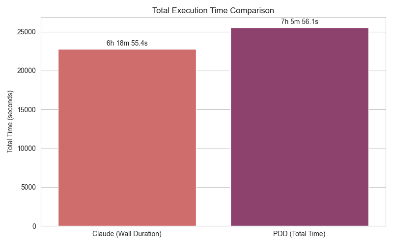
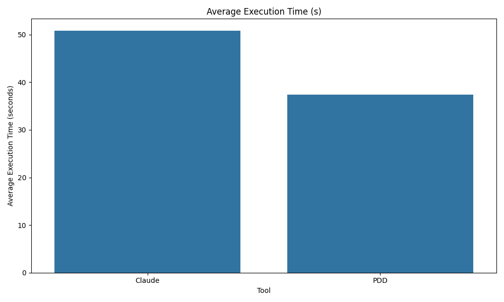
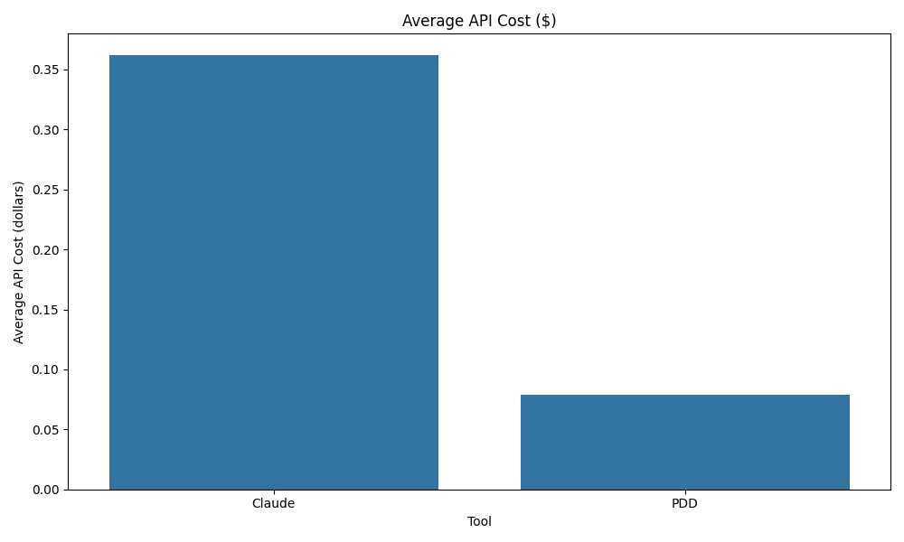

#### **2.2 Methodology**

This case study involved the independent development of an "Edit File Tool" using two distinct methodologies: Prompt-Driven Development (PDD) and Anthropic's `claude-code` CLI tool, a state-of-the-art agentic coding assistant. To ensure a fair comparison and control for user skill, the same developer, proficient in both PDD and agentic tool usage, developed for both systems. Both development efforts aimed to create a tool that leverages Claude's `text_editor_20250124` model for performing file edits based on natural language instructions.

The `claude-code` workflow consisted of the developer issuing high-level natural language commands in the terminal (e.g., "implement the main file editing logic," "add error handling," "write tests for the core function"). An "attempt" was defined as a continuous session of work. The multiple attempts recorded reflect sessions where the agent failed to produce a viable, complete solution, requiring the developer to restart the process.

Once developed, both tools were subjected to a standardized benchmark suite. The benchmark tasks were designed to cover a range of common editing scenarios, varying across:
*   **File Sizes**: small, medium, and large.
*   **Programming Languages**: Python, JavaScript, and TypeScript.
*   **Edit Types**: simple, complex, insert, multiple, and format.

Performance was measured based on success rate, execution time, and API costs. The creation process itself was also analyzed for cost and time. Data for this analysis is sourced from the `PDD_creation.csv`, `claude_creation.csv`, and the consolidated benchmark results detailed in the `BENCHMARK_REPORT` and `analysis/creation_report` sections of this whitepaper.

#### **Failure Criteria and Iteration Limits**

To ensure fair comparison and prevent infinite loops, both development approaches were subject to identical constraints:

- **Maximum Iterations per Task**: Both PDD and Claude Code were limited to 5 iterations/attempts per individual task during the benchmark phase
- **Failure Definition**: A task was considered failed if it could not be completed successfully within the 5-iteration limit
- **Creation Phase vs. Benchmark Phase**: The "attempts" mentioned in creation (5 attempts for Claude Code) refer to complete development sessions where the agent failed to produce a viable tool, requiring the developer to restart the entire process. The 5-iteration limit applies to individual benchmark tasks run against the completed tools.

This constraint explains the significant difference in success rates: PDD's tool consistently completed tasks within 5 iterations (100% success rate). In constrast, while Claude Code's tool frequently exceeded this limit (46.67% success rate), indicating difficulty in converging on correct solutions.

#### **PDD Toolchain Implementation Details**

The PDD development process followed a structured 8-phase workflow for each module, as exemplified by the cost_tracker component:

**Phase 1: Generate Initial Prompt**
```bash
pdd generate --output "cost_tracker/cost_tracker_python.prompt" "cost_tracker/cost_tracker_python_prompt.prompt"
```

**Phase 2: Find Dependencies (auto-deps)**
```bash
pdd auto-deps --output "cost_tracker/cost_tracker_modified_prompt.prompt" "cost_tracker/cost_tracker_python.prompt" "."
```

**Phase 3: Generate Function**
```bash
pdd generate --output "cost_tracker/cost_tracker.py" "cost_tracker/cost_tracker_modified_prompt.prompt"
```

**Phase 4: Create Example**
```bash
pdd example --output "cost_tracker/cost_tracker_example.py" "cost_tracker/cost_tracker_python_prompt.prompt" "cost_tracker/cost_tracker.py"
```

**Phase 5: Verify Logical Correctness (Max 3 Attempts)**
```bash
pdd verify --max-attempts 3 --output-code "cost_tracker/cost_tracker_verified.py" --output-program "cost_tracker/cost_tracker_example_verified.py" [...]
```

**Phase 6: Generate Unit Tests**
```bash
pdd test --output "test_cost_tracker.py" "cost_tracker/cost_tracker_modified_prompt.prompt" "cost_tracker/cost_tracker_iteration_2.py"
```

**Phase 7: Fix Unit Test Failures (Max 3 Attempts)**
```bash
pdd fix --loop --max-attempts 3 --verification-program "verify_cost_tracker_fix.py" [...]
```

**Phase 8: Organize Final Outputs**
Final file organization and placement in the project structure.

Each module of the Edit File Tool was generated using this systematic process, with initial prompts derived from the project's README document. This structured approach aligns with the PDD workflow diagram shown earlier in this paper, ensuring consistent, reproducible development across all components.

#### **2.3 Key Performance Metrics**

The development workflows and associated costs for creating the Edit File Tool differed substantially between PDD and Claude Code.

*   **PDD**: The PDD approach involved a single, monolithic session that generated 9,718 lines of working code. This process incurred a total cost of $29.92 and took 7h 5m 56.1s (25556.13 seconds). The average cost per module within this process was $0.3990.
*   **Claude Code**: The development using Claude Code consisted of 5 isolated attempts, totaling 7,159 lines of code (net 5,759 lines added). The aggregated cost for these attempts was $28.53, with a total wall duration of 6h 18m 55.4s (22735.40 seconds). The average cost per run was $5.7066.

While the total creation costs and times appear somewhat comparable in aggregate, the PDD approach yielded a fully functional tool in one comprehensive effort. In contrast, the Claude Code approach involved multiple, potentially incomplete or iterative, attempts. This difference in process is also reflected in development efficiency. We can measure this as lines of code generated per dollar spent:

*   **PDD**: 9,718 lines / $29.92 = **324.80 lines per dollar**
*   **Claude Code**: 7,159 lines (total added) / $28.53 = **250.93 lines per dollar**

PDD produced a more reliable tool and was more cost-effective in the generation phase itself.

#### **Development Process Efficiency**

The fundamental difference in development approaches becomes clear when examining the creation statistics:

- **PDD**: Single comprehensive session generating a complete, functional tool (9,718 lines) with systematic verification at each step
- **Claude Code**: Multiple failed attempts requiring complete restarts, indicating the interactive approach's vulnerability to partial failures and abandonment

This pattern suggests that PDD's batch-oriented, systematic approach provides better protection against development dead-ends. In contrast, interactive approaches may encourage partial work that ultimately proves unviable, leading to wasted effort and complete restarts.


#### **2.4 Benchmark Results - Reliability and Efficiency**

Once developed, the two tools were subjected to a benchmark suite of 45 tasks. The results reveal a significant disparity in reliability and performance.

#### **Runtime Efficiency: Time and Cost**

The **cost per *successful* task** for Claude Code's tool skyrockets to **$0.7751**, nearly ten times that of PDD's $0.0789. This highlights the hidden cost of unreliability.

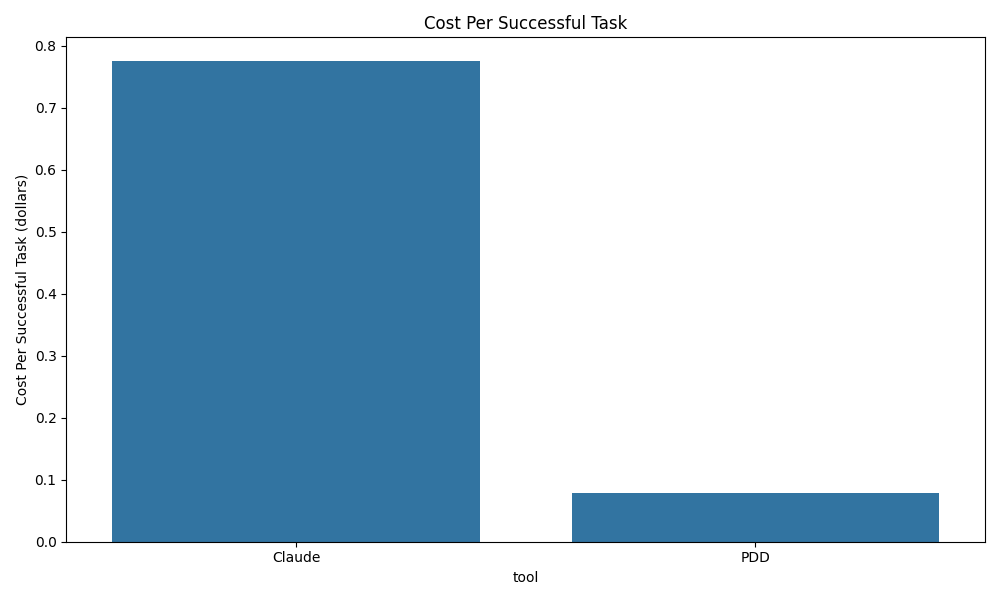

#### **Performance by Task Dimension**

The performance gap persists across different file sizes and edit types.

**By File Size**
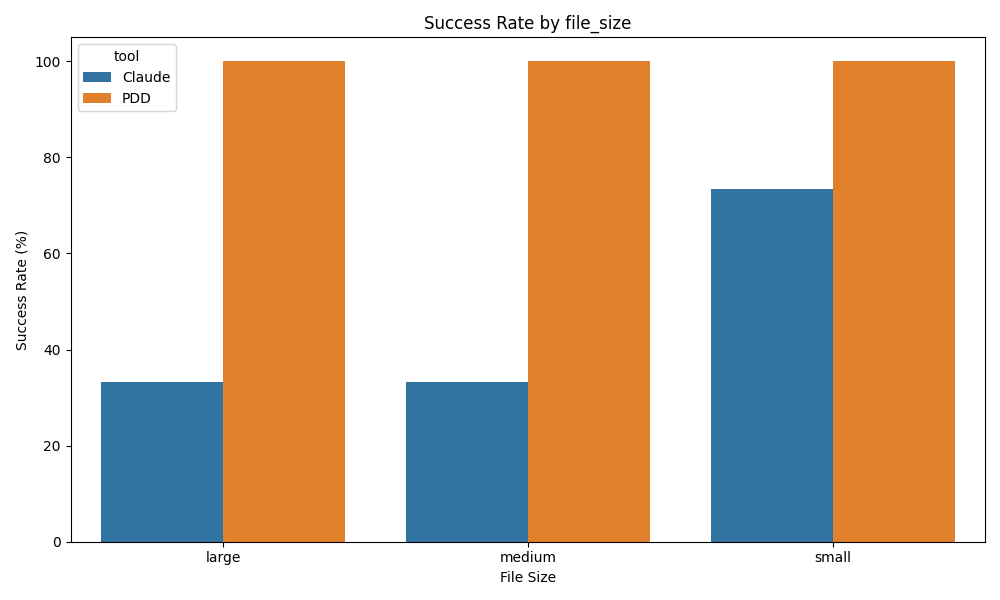

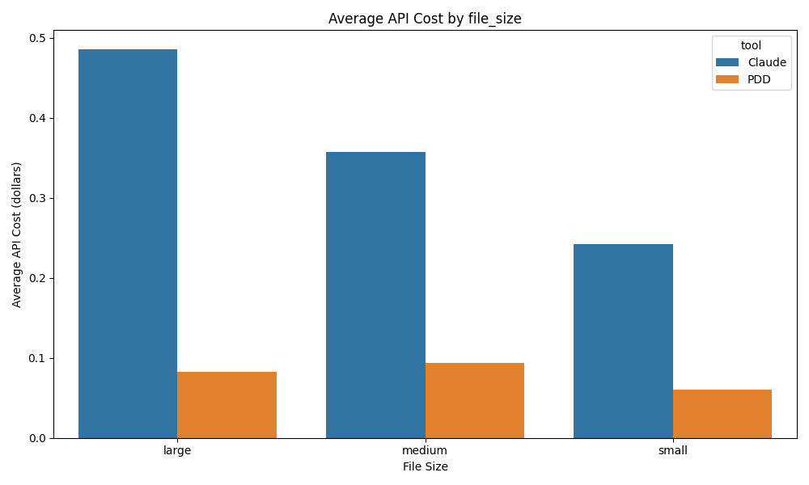

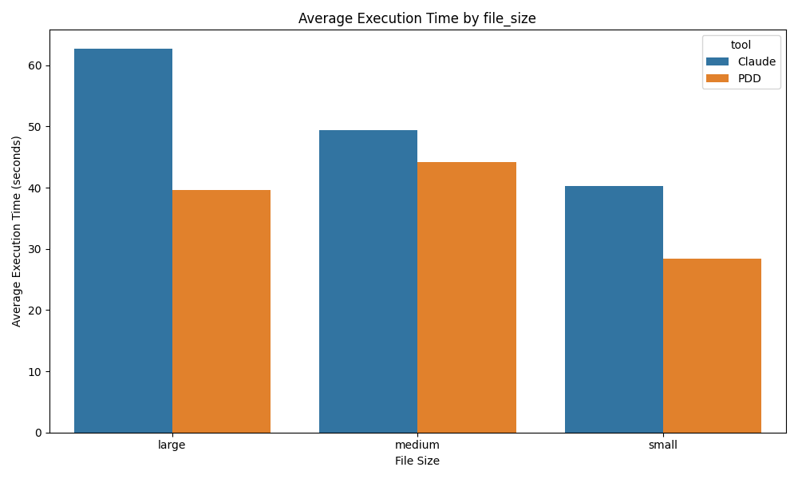

**By Edit Type**
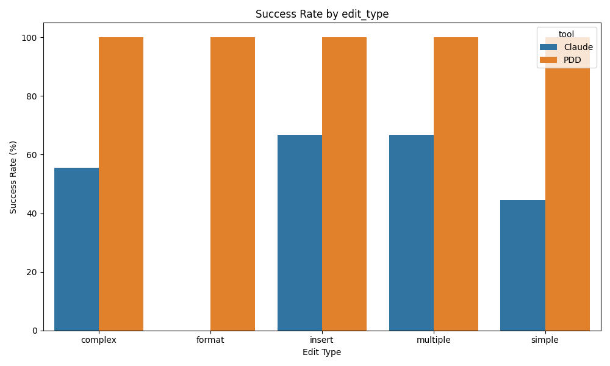

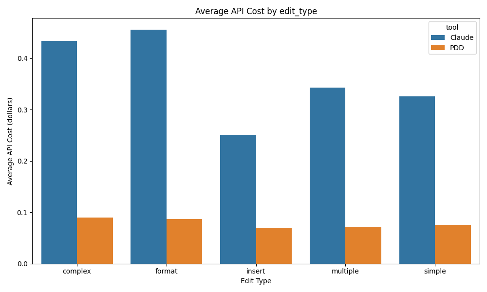

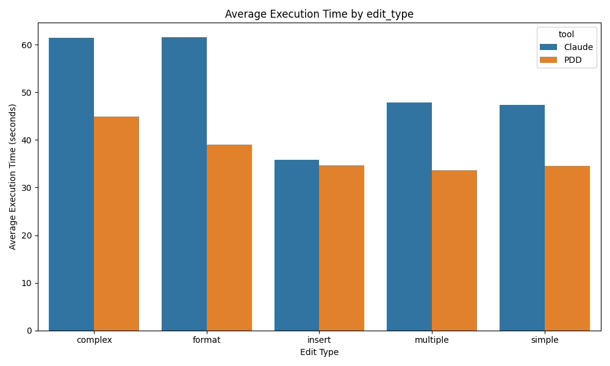

#### **2.5 Qualitative Analysis & Developer Experience**

The benchmark data reveals a critical difference in convergence capability. Claude Code's primary failure mode occurred in 24 of the 45 benchmark tasks: "Editing process exceeded maximum iterations." With both tools subject to identical 5-iteration limits per task, this pattern indicates that Claude Code's tool struggled to converge on correct solutions within practical constraints.

This convergence failure suggests several potential issues:
1. **Context Loss**: The iterative editing approach may lose track of the overall goal across multiple edit cycles
2. **Conflicting Constraints**: The tool may attempt to satisfy contradictory requirements introduced during the editing process  
3. **Insufficient Systematic Approach**: Unlike PDD's structured workflow (generate → example → verify → test → fix), the iterative editing approach lacks systematic validation steps

The 5-iteration limit was chosen to reflect real-world constraints where developers cannot afford infinite attempts to achieve a working solution. PDD's 100% success rate within this constraint demonstrates superior practical reliability.

The higher variance in wall time for Claude Code's creation runs (std: 4119.79 seconds vs. PDD's more consistent module times, though PDD's `main_editor` module was an outlier) and its multiple-attempt nature point to a higher risk of abandonment or significant rework. Developers using such an approach might invest considerable time in an attempt only to find it unsuccessful, necessitating further costly retrials.

In contrast, PDD's structured, batch-oriented loop, while potentially longer in a single session for a complex tool, successfully generated a complete, functioning Edit File Tool in one go. This suggests that PDD's methodology, which breaks down the problem into manageable, interconnected steps (prompt definition, code generation, example creation, testing, fixing, and updating), is more robust for complex development tasks.

A hypothesis arising from this is that the modular, iterative nature of direct Claude Code editing, when applied to a substantial tool, encourages partial work and frequent retrials upon failure. PDD's emphasis on a complete, synchronized workflow from the outset appears to mitigate this risk, leading to a more predictable and ultimately successful development outcome for complex projects.

This points to a fundamental difference in cognitive load. When using an agentic tool, the developer must constantly hold the desired end-state, the agent's recent actions, and the current state of the code in their working memory. They are actively steering at every turn. 

PDD offloads this cognitive burden. By first externalizing the desired outcome into a detailed prompt, the developer's primary focus shifts to defining intent at a high level. The `generate`, `test`, and `fix` cycle becomes a more methodical, less mentally taxing process of verifying the output against a pre-defined specification. 

This allows the developer to conserve their mental energy for high-level architectural decisions rather than expending it on the turn-by-turn supervision of an interactive agent—a key factor in successfully completing complex tasks.

#### **2.6 Conclusion: Predictability is Priceless**

While the upfront development costs and times for PDD and Claude Code appear comparable at first glance, this case study reveals that PDD offers a more robust and predictable path to creating complex, reliable software.

The Claude Code agent's 47% success rate demonstrates a high risk of project failure. It produces a tool that is less reliable in practice and nearly 10x more expensive per successful operation. The iterative, multi-attempt nature of its development process introduces uncertainty and a high potential for wasted time and resources.

In contrast, PDD delivered a 100% successful tool in a single, comprehensive session. By front-loading the effort into structured prompts, PDD mitigates risk and reduces the cognitive load on the developer, trading frantic, turn-by-turn agent supervision for a methodical verification process.

Ultimately, this study favors PDD's structured workflow. For complex projects where reliability, efficiency, and predictability are paramount, it is the superior methodology, yielding a better final product at a dramatically lower effective cost.

### **Detailed Analysis References**

For comprehensive data analysis and deeper insights into these benchmark studies, readers can reference:

- **Runtime Performance Analysis**: `docs/whitepaper_with_benchmarks/analysis_report/benchmark_analysis.md` - Contains detailed statistical analysis, performance breakdowns by task dimensions, cost-efficiency analysis, and error pattern analysis for the Edit File Tool benchmark.

- **Creation Process Analysis**: `docs/whitepaper_with_benchmarks/creation_report/creation_analysis_report.md` - Provides in-depth analysis of the development costs, time distributions, code generation metrics, and efficiency comparisons for both PDD and Claude Code creation processes.

- **Raw Data and Analysis Functions**: `docs/whitepaper_with_benchmarks/data_and_functions/` - Contains the source data files (`PDD_results.csv`, `claude_results.csv`, `PDD_creation.csv`, `claude_creation.csv`) and the Python analysis scripts (`benchmark_analysis.py`, `creation_compare.py`) used to generate the statistical reports.

These resources provide statistical significance testing, confidence intervals, detailed cost breakdowns, time distribution analysis, and comprehensive performance metrics that support the conclusions presented in this whitepaper.

### **Integrated Case Study Conclusions**

The two case studies demonstrate PDD's effectiveness across diverse application domains:

**Cross-Domain Effectiveness:**
- **Creative Applications** (HandPaint): PDD excels in user experience-focused development with 55% reduction in active developer time
- **Developer Tooling** (Edit File Tool): PDD achieves 100% success rate vs. 46.67% for interactive approaches in complex, reliability-critical applications

**Consistent Advantages:**
1. **Cognitive Load Reduction**: Both studies show PDD reduces mental burden through batch processing and structured workflows
2. **Cost Efficiency**: Demonstrable cost advantages in both simple ($0.19/run) and complex ($0.0789/task) development scenarios  
3. **Time Optimization**: Background processing enables multitasking and reduces active supervision requirements
4. **Scalability**: Batch-oriented approach proves effective for both rapid prototyping and comprehensive tool development

**Methodological Validation:**
The diversity of applications (interactive UI vs. CLI tool), development approaches (Vibecoding vs. Claude Code), and underlying models (Gemini vs. Claude) strengthens the generalizability of PDD's advantages. The consistent pattern of superior resource utilization and developer experience across different domains supports PDD as a robust development methodology rather than a tool-specific optimization.

These findings position PDD as particularly valuable for teams prioritizing efficiency, cost-effectiveness, and predictable outcomes across varied software development contexts.

## **Future Directions**

PDD continues to evolve as an active methodology with several key initiatives underway to enhance its capabilities and ecosystem:

- **PDD Cloud**: A platform to store and share few-shot examples, providing crucial context to Large Language Models (LLMs) during generation. This enables higher quality results even with less powerful models by creating a marketplace for valuable context. The cloud platform leverages the community's collective expertise to improve code generation quality across the ecosystem.
- **VS Code Extension**: Provides syntax highlighting and tooling support for `.prompt` files within the popular editor, making PDD more accessible to developers by integrating directly into their existing workflows.

These efforts represent an active community investment in expanding PDD's capabilities while maintaining its core principles of structured, regenerative development.

## **Conclusion**

Prompt-Driven Development offers a compelling alternative to traditional coding paradigms and purely interactive AI approaches, directly addressing the high cost and complexity of software maintenance while demonstrating broad applicability across diverse development contexts. The benchmark studies presented in this paper validate PDD's effectiveness across different application domains, from creative interactive applications to complex developer tooling.

By establishing prompts as the primary artifact, emphasizing regeneration over patching, and leveraging LLMs within a structured, batch-oriented workflow for code generation and synchronization, PDD consistently delivers:

- **Cognitive Load Reduction**: 55% reduction in active developer time (HandPaint) and a systematic workflow that eliminates constant supervision requirements
- **Superior Reliability**: 100% success rate in complex scenarios vs. 46.67% for interactive approaches  
- **Cost Efficiency**: Demonstrable cost advantages across both simple prototyping ($0.19/run) and complex development ($0.0789/task) scenarios
- **Cross-Domain Effectiveness**: Proven benefits for both user-facing applications and developer infrastructure tools

The methodological validation through diverse approaches (Vibecoding, Claude Code), different models (Gemini, Claude), and varied application types (UI-focused, CLI-based) strengthens confidence in PDD's generalizability. The consistent patterns of resource optimization and developer experience improvements across these contexts position PDD not as a niche optimization but as a fundamental advancement in software engineering methodology.

While requiring a shift in mindset and acknowledging that interactive tools have their place for specific tasks, the empirical evidence demonstrates that PDD's benefits represent a significant evolution in software engineering practices. This is particularly true for projects prioritizing efficiency, reliability, and cost-effectiveness. 

PDD enables developers to work faster, more strategically, and at a higher level of abstraction while maintaining the predictability and control essential for professional software development.