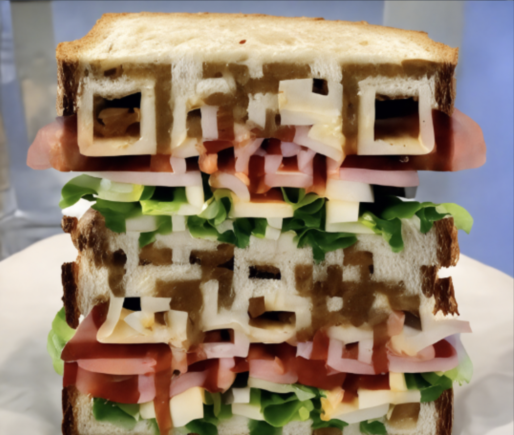

# QRCode-Gen: AI-Generated QR Codes with PDD

This is a **PDD (Prompt-Driven Development)** example that demonstrates how to generate QR codes that look like realistic images using AI. The project uses ControlNet technology to overlay QR codes onto photorealistic images, creating visually appealing QR codes that blend seamlessly with the background.

## What This Example Does

This PDD example generates Python code that creates QR codes embedded in realistic images. For instance, it can generate a QR code that appears to be part of a sandwich, making it both functional (scannable) and visually appealing. The generated code uses ControlNet QR conditioning to ensure the QR code remains readable while looking like a natural part of the image.

### Example Output

Here's what the generated code produces - a QR code that looks like it's part of a sandwich:



---

## Prerequisites

Before using this example, you need to install PDD (Prompt-Driven Development) CLI.

### Installing PDD

#### Recommended Method: uv (Fastest)

```bash
# Install uv if you haven't already 
curl -LsSf https://astral.sh/uv/install.sh | sh

# Install PDD using uv tool install
uv tool install pdd-cli
```

Verify installation:
```bash
pdd --version
```

#### Alternative: pip Installation

```bash
pip install pdd-cli
```

#### Virtual Environment Installation (Optional)

```bash
# Create virtual environment
python -m venv pdd-env

# Activate environment
# On Windows:
pdd-env\Scripts\activate
# On Unix/MacOS:
source pdd-env/bin/activate

# Install PDD
pip install pdd-cli
```

### PDD Authentication

PDD runs in cloud mode by default, which requires GitHub authentication:

1. On first use, PDD will open your browser to GitHub login
2. Log in and authorize PDD Cloud
3. Return to your terminal to continue

For local mode, you'll need API keys (see [main PDD README](../README.md) for details).

---

## Installation & Setup

### 1. Clone & Install Dependencies

```bash
git clone https://github.com/gltanaka/pdd.git
cd qrcode_sandwich
pip install -r requirements.txt
```

### 2. Configure Models (`llm_model.csv`)

QRCode-Gen follows the same tiered model configuration as PDD:

- **User-specific:** `~/.pdd/llm_model.csv`  
- **Project-specific:** `<PROJECT_ROOT>/.pdd/llm_model.csv`  
- **Package default:** falls back to bundled config

Trim your `llm_model.csv` accordingly to the models you have. If you only have **Gemini 2.5 Flash**, for example:

```csv
provider,model,input,output,coding_arena_elo,base_url,api_key,max_reasoning_tokens,structured_output,reasoning_type
Google,gpt-4.1-nano,0.1,0.4,1249,,OPENAI_API_KEY,0,True,none
Google,gemini/gemini-2.5-flash,0.15,0.6,1330,,GEMINI_API_KEY,0,True,effort
```

Note: I have **GPT 4.1 Nano** included because it is my default model. However, you can set an env variable to have a different model as default.

See the [main PDD README](../README.md) for a full explanation of how `llm_model.csv` works.

### 3. Setup Firecrawl and Add Environment Variables

QRCode-Gen uses Firecrawl to scrape the code from https://huggingface.co/DionTimmer/controlnet_qrcode-control_v1p_sd15. An API key is required to use Firecrawl.

Populate a `.env` file (or export in your shell config):

```bash
GEMINI_API_KEY=your_key_here
FIRECRAWL_API_KEY=your_key_here
```

---

## Usage

### Generate a QR Code

Once setup is complete, you can create a QR code by writing a `.prompt` file and running:

```bash
pdd generate my_qrcode_{language}.prompt
```

### Example: QR Code Sandwich

```bash
pdd generate qrcode_sandwich_python.prompt
```

Where `qrcode_sandwich_python.prompt` contains instructions like:

```
<note>
This prompt is designed to guide code generation for a ControlNet-based image synthesis pipeline. It instructs the model to generate Python code that overlays a QR code pointing to "https://PromptDriven.ai" into a realistic sandwich image using ControlNet QR conditioning. Do not install `xformers`, as it is not compatible with macOS.
</note>
...
```

The prompt will generate a script that can be run to produce a QR code overlaid onto an image. It will take many tweaks to the parameters to get a working QR code on an image.

The generated QR code will be saved in the path you've configured (`$PDD_GENERATE_OUTPUT_PATH`), or in the working directory if not set.

---

## How PDD Works

This example demonstrates the power of **Prompt-Driven Development (PDD)**:

1. **Write a prompt** describing what you want to create
2. **PDD generates the code** that implements your vision
3. **Run the generated code** to see your QR code come to life
4. **Iterate and improve** by modifying the prompt

PDD handles the complex implementation details while you focus on describing your desired outcome in natural language.

---

## Learn More

- [Main PDD Documentation](../README.md) - Complete guide to Prompt-Driven Development
- [PDD Whitepaper](../docs/whitepaper_with_benchmarks/whitepaper_w_benchmarks.md) - In-depth explanation of PDD concepts
- [PDD Cloud Dashboard](https://promptdriven.ai/) - Track usage and access shared examples